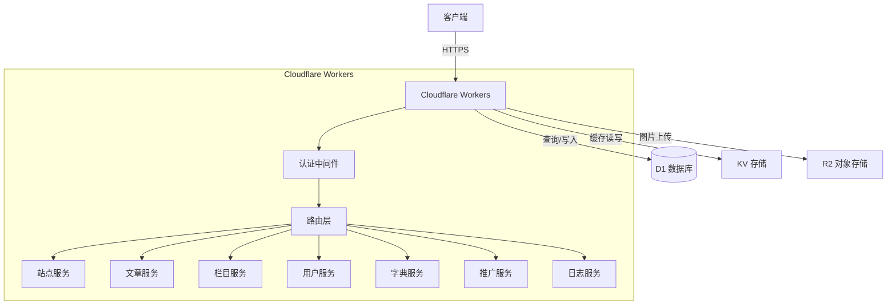
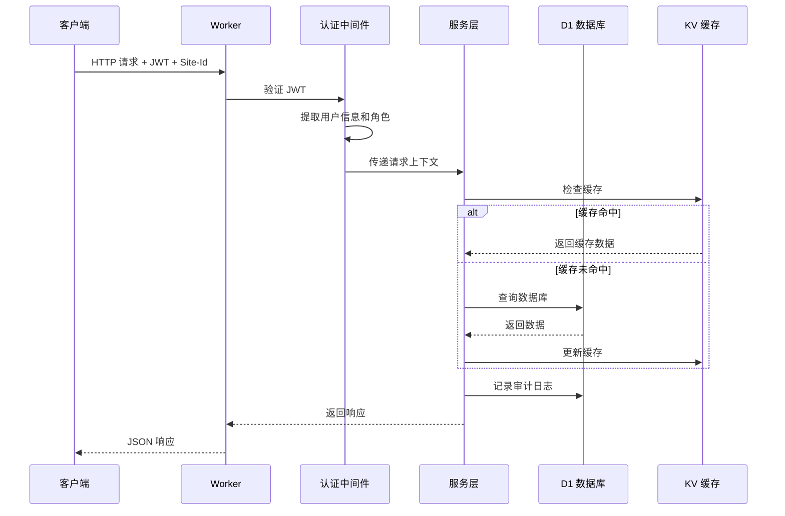
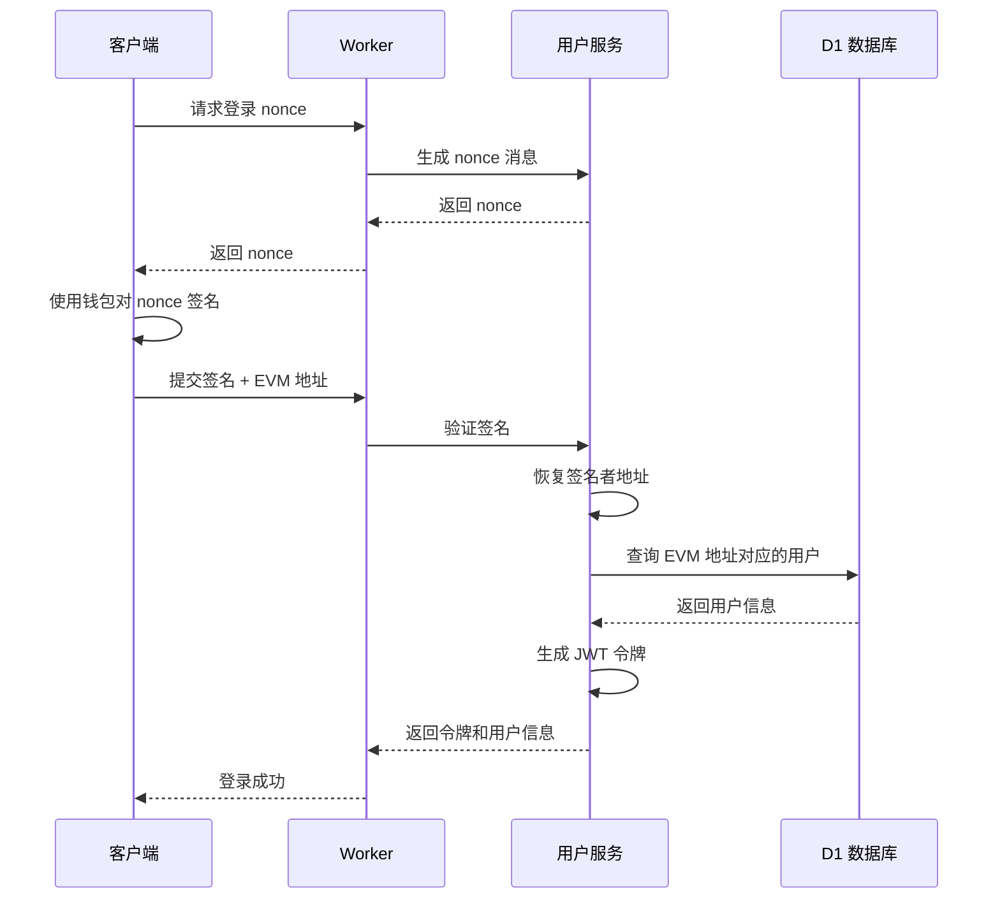
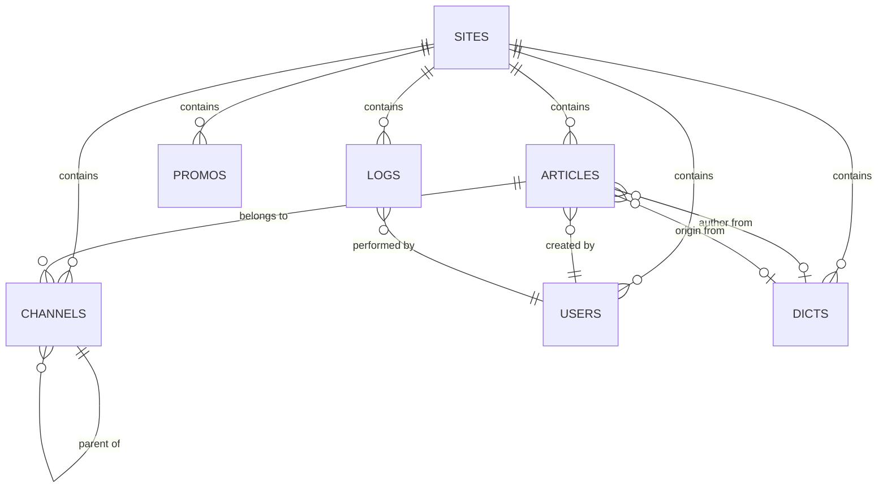

# 设计文档

## 重要说明：数据库架构

本设计文档严格遵循 DOUBAO-README.md 中定义的原始数据库架构。关键架构决策：

### 表结构
- **Site 表**：管理多站点信息（名称、标题、LOGO、关键词、描述、版权等）
- **Article 表**：完整字段包括 description、markdown、img、video、author、author_id、origin、origin_id、editor_id、user_id、type、is_top
- **Channel 表**：使用 pid（父ID）、sort（排序）、keywords、description、type、img 字段
- **User 表**：包含 nickname、avatar、phone、gender、last_login_time、evm_address（EVM 钱包地址），使用 type 字段（UserTypeEnum）而非 role
- **Dicts 表**：包含 sort 字段用于排序
- **Ad 表**：使用 img、url、position、content 字段
- **Logs 表**：包含 module 字段（ModuleEnum）用于标识操作模块

### 软删除实现
使用 `status` 字段（StatusEnum）实现软删除，而不是 `is_deleted` 布尔字段：
- `StatusEnum.PENDING`：待审核
- `StatusEnum.NORMAL`：正常/审核通过
- `StatusEnum.FAILURE`：审核未通过
- `StatusEnum.DELETE`：已删除（软删除）

### 时间戳字段
使用 `created_at` 和 `update_at`（注意不是 updatedAt）

### 枚举系统
完整的枚举定义包括：StatusEnum、UserTypeEnum、GenderEnum、EditorEnum、DictTypeEnum、ChannelTypeEnum、ArticleTypeEnum、LogTypeEnum、BusinessCode、ModuleEnum

## 概述

Cloudflare CMS API 是一个基于 Cloudflare Workers 的无服务器多租户内容管理系统。系统采用 RESTful API 设计，使用 Hono 框架处理 HTTP 请求，Drizzle ORM 管理数据库操作，D1 作为 SQLite 兼容的数据库，R2 用于图片存储，KV 用于缓存。

核心设计原则：
- 多租户隔离：所有数据通过 site_id 完全隔离，每个站点拥有独立的文章、栏目、用户、字典和推广数据
- 站点管理：Site 表存储站点基本信息（名称、标题、LOGO、关键词、描述、版权等）
- 安全优先：JWT 认证、密码哈希（SHA256+PBKDF2）、EVM 钱包签名认证、角色权限控制
- 性能优化：数据库索引、KV 缓存、分页查询
- 审计追踪：所有状态变更操作记录日志
- 软删除：使用 status 字段实现软删除（StatusEnum.DELETE），保留数据用于恢复和合规
- 多种登录方式：支持传统用户名+密码登录和 EVM 钱包签名登录

## 架构

### 系统架构图



### 请求处理流程



### EVM 钱包登录流程



## 组件和接口

### 1. 认证中间件（Auth Middleware）

负责验证 JWT 令牌和提取用户上下文。

```typescript
interface AuthContext {
  userId: number
  username: string
  type: UserTypeEnum
  siteId: number | null
}

interface AuthMiddleware {
  // 验证 JWT 令牌并提取用户信息
  authenticate(token: string): Promise<AuthContext>
  
  // 验证用户是否有权限执行操作
  authorize(context: AuthContext, requiredType: UserTypeEnum): boolean
}
```

### 2. 站点隔离中间件（Site Isolation Middleware）

确保所有请求都包含 Site-Id 头并注入到查询上下文。

```typescript
interface SiteContext {
  siteId: number
}

interface SiteMiddleware {
  // 从请求头提取 site_id
  extractSiteId(headers: Headers): number
  
  // 验证 site_id 是否有效
  validateSiteId(siteId: number): boolean
}
```

### 3. 站点服务（Site Service）

管理站点信息。

```typescript
interface Site {
  id: number
  name: string
  title: string
  logo: string
  keywords: string
  description: string
  copyright: string
  status: StatusEnum
  created_at: Date
  update_at: Date
}

interface SiteService {
  // 创建站点
  create(data: CreateSiteInput, context: AuthContext): Promise<Site>
  
  // 更新站点
  update(id: number, data: UpdateSiteInput, context: AuthContext): Promise<Site>
  
  // 查询站点
  query(params: QueryParams): Promise<PaginatedResult<Site>>
  
  // 获取单个站点
  getById(id: number): Promise<Site | null>
}
```

### 4. 文章服务（Article Service）

管理文章的 CRUD 操作。

```typescript
interface Article {
  id: number
  title: string
  channel_id: number
  tags: string
  description: string
  content: string
  markdown: string
  img: string
  video: string
  author: string
  author_id: number | null
  origin: string
  origin_id: number | null
  editor_id: number | null
  user_id: number | null
  type: ArticleTypeEnum
  status: StatusEnum
  is_top: number
  site_id: number
  created_at: Date
  update_at: Date
}

interface ArticleService {
  // 创建文章
  create(data: CreateArticleInput, context: AuthContext & SiteContext): Promise<Article>
  
  // 更新文章
  update(id: number, data: UpdateArticleInput, context: AuthContext & SiteContext): Promise<Article>
  
  // 软删除文章（设置status为DELETE）
  delete(id: number, context: AuthContext & SiteContext): Promise<void>
  
  // 查询文章（支持过滤、排序、分页）
  query(params: QueryParams, context: SiteContext): Promise<PaginatedResult<Article>>
  
  // 获取单个文章
  getById(id: number, context: SiteContext): Promise<Article | null>
  
  // 审核文章
  audit(id: number, status: StatusEnum, reason?: string, context: AuthContext & SiteContext): Promise<Article>
}
```

### 5. 栏目服务（Channel Service）

管理层级栏目结构。

```typescript
interface Channel {
  id: number
  name: string
  pid: number
  sort: number
  keywords: string
  description: string
  type: ChannelTypeEnum
  status: StatusEnum
  img: string
  site_id: number
  created_at: Date
  update_at: Date
}

interface ChannelTree extends Channel {
  children: ChannelTree[]
}

interface ChannelService {
  // 创建栏目
  create(data: CreateChannelInput, context: AuthContext & SiteContext): Promise<Channel>
  
  // 更新栏目
  update(id: number, data: UpdateChannelInput, context: AuthContext & SiteContext): Promise<Channel>
  
  // 软删除栏目（设置status为DELETE）
  delete(id: number, context: AuthContext & SiteContext): Promise<void>
  
  // 获取栏目树（带缓存）
  getTree(context: SiteContext): Promise<ChannelTree[]>
  
  // 验证父栏目是否存在
  validateParent(pid: number, context: SiteContext): Promise<boolean>
}
```

### 6. 用户服务（User Service）

管理用户账户和认证，支持传统密码登录和 EVM 钱包签名登录。

```typescript
interface User {
  id: number
  username: string
  password: string
  nickname: string
  avatar: string
  email: string
  phone: string
  gender: GenderEnum
  type: UserTypeEnum
  site_id: number | null
  status: StatusEnum
  last_login_time: Date | null
  evm_address: string | null  // EVM 钱包地址（可选）
  created_at: Date
  update_at: Date
}

interface UserService {
  // 创建用户（密码自动哈希）
  create(data: CreateUserInput, context: AuthContext & SiteContext): Promise<User>
  
  // 更新用户
  update(id: number, data: UpdateUserInput, context: AuthContext & SiteContext): Promise<User>
  
  // 软删除用户（设置status为DELETE）
  delete(id: number, context: AuthContext & SiteContext): Promise<void>
  
  // 用户登录（用户名+密码）
  login(username: string, password: string, siteId: number): Promise<LoginResult>
  
  // EVM 钱包登录（签名验证）
  loginWithWallet(evmAddress: string, signature: string, message: string, siteId: number): Promise<LoginResult>
  
  // 生成钱包登录的 nonce 消息
  generateWalletLoginMessage(): string
  
  // 验证 EVM 签名并恢复地址
  verifySignature(message: string, signature: string): string
  
  // 验证用户名唯一性
  validateUsername(username: string, siteId: number): Promise<boolean>
  
  // 验证邮箱唯一性
  validateEmail(email: string, siteId: number): Promise<boolean>
  
  // 验证 EVM 地址唯一性
  validateEvmAddress(evmAddress: string, siteId: number): Promise<boolean>
  
  // 验证 EVM 地址格式
  validateEvmAddressFormat(evmAddress: string): boolean
  
  // 通过 EVM 地址查找用户
  findByEvmAddress(evmAddress: string, siteId: number): Promise<User | null>
  
  // 重置密码
  resetPassword(id: number, newPassword: string, oldPassword?: string, context: AuthContext & SiteContext): Promise<void>
}

interface LoginResult {
  token: string
  user: Omit<User, 'password'>
}
```

### 7. 字典服务（Dictionary Service）

管理可重用的元数据条目。

```typescript
interface Dict {
  id: number
  name: string
  type: DictTypeEnum
  value: string
  sort: number
  site_id: number
  status: StatusEnum
  created_at: Date
  update_at: Date
}

interface DictService {
  // 创建字典条目
  create(data: CreateDictInput, context: AuthContext & SiteContext): Promise<Dict>
  
  // 更新字典条目
  update(id: number, data: UpdateDictInput, context: AuthContext & SiteContext): Promise<Dict>
  
  // 软删除字典条目（设置status为DELETE）
  delete(id: number, context: AuthContext & SiteContext): Promise<void>
  
  // 按类型查询字典条目
  queryByType(type: DictTypeEnum, context: SiteContext): Promise<Dict[]>
}
```

### 8. 推广服务（Promo Service）

管理基于时间的推广内容展示。

```typescript
interface Promo {
  id: number
  title: string
  img: string
  url: string
  position: string
  content: string
  start_time: Date
  end_time: Date | null
  sort: number
  site_id: number
  status: StatusEnum
  created_at: Date
  update_at: Date
}

interface PromoService {
  // 创建推广
  create(data: CreatePromoInput, context: AuthContext & SiteContext): Promise<Promo>
  
  // 更新推广
  update(id: number, data: UpdatePromoInput, context: AuthContext & SiteContext): Promise<Promo>
  
  // 软删除推广（设置status为DELETE）
  delete(id: number, context: AuthContext & SiteContext): Promise<void>
  
  // 获取当前活动的推广（带缓存）
  getActive(context: SiteContext): Promise<Promo[]>
  
  // 切换推广状态
  toggleStatus(id: number, status: StatusEnum, context: AuthContext & SiteContext): Promise<Promo>
}
```

### 9. 审计日志服务（Audit Log Service）

记录所有状态变更操作。

```typescript
interface Log {
  id: number
  user_id: number | null
  username: string
  type: LogTypeEnum
  module: ModuleEnum
  content: string
  ip: string
  user_agent: string
  site_id: number | null
  created_at: Date
}

interface LogService {
  // 记录操作日志
  log(data: CreateLogInput): Promise<void>
  
  // 查询日志（支持过滤）
  query(params: LogQueryParams, context: SiteContext): Promise<PaginatedResult<Log>>
  
  // 清理过期日志
  clean(days: number, context: AuthContext): Promise<void>
}
```

### 9. 图片上传服务（Image Upload Service）

处理图片上传到 R2，使用 SHA256 hash 实现自动去重。

```typescript
interface ImageUploadService {
  // 上传图片到 R2
  // 使用文件内容的 SHA256 hash 作为文件名，实现自动去重
  // 上传前检查文件是否已存在，如已存在则直接返回 URL，避免重复上传
  upload(file: File, context: SiteContext): Promise<ImageUploadResult>
  
  // 生成唯一文件名（已弃用，保留以备将来使用）
  // 当前实现使用 SHA256 hash 作为文件名
  // @deprecated 使用 SHA256 hash 作为文件名替代
  generateFilename(originalName: string, siteId: number): string
  
  // 验证文件类型
  validateImageType(file: File): boolean
}

interface ImageUploadResult {
  url: string
  filename: string
}
```

**去重机制说明**：
- 文件名格式：`{siteId}/{sha256Hash}.{extension}`
- 同一张图片（内容相同）会生成相同的 hash，因此会使用相同的文件名
- 上传前通过 R2 的 `head()` 方法检查文件是否已存在
- 如果文件已存在，直接返回 URL，不重复上传
- 忽略 hash 碰撞的可能性（SHA256 碰撞几率极低，在小型系统中可以忽略）

### 10. 查询构建器（Query Builder）

处理通用查询规范。

```typescript
interface QueryParams {
  // 过滤参数
  filters?: Record<string, any>
  
  // 排序参数
  sort?: string
  sortOrder?: 'asc' | 'desc'
  
  // 分页参数
  page?: number
  pageSize?: number
  
  // 搜索参数
  search?: string
  searchFields?: string[]
  
  // 比较运算符
  comparisons?: {
    field: string
    operator: 'gt' | 'lt' | 'gte' | 'lte'
    value: any
  }[]
}

interface PaginatedResult<T> {
  data: T[]
  total: number
  page: number
  pageSize: number
  totalPages: number
}

interface QueryBuilder {
  // 构建查询
  build(params: QueryParams, baseQuery: any): any
  
  // 应用站点过滤
  applySiteFilter(query: any, siteId: number): any
  
  // 应用软删除过滤
  applySoftDeleteFilter(query: any): any
}
```

### 11. 缓存管理器（Cache Manager）

管理 KV 缓存操作。

```typescript
interface CacheManager {
  // 获取缓存
  get<T>(key: string): Promise<T | null>
  
  // 设置缓存
  set<T>(key: string, value: T, ttl: number): Promise<void>
  
  // 删除缓存
  delete(key: string): Promise<void>
  
  // 批量删除缓存（按前缀）
  deleteByPrefix(prefix: string): Promise<void>
  
  // 生成缓存键
  generateKey(type: string, siteId: number, ...parts: string[]): string
}
```

## 数据模型

### 软删除实现说明

本系统使用 `status` 字段实现软删除，而不是单独的 `is_deleted` 布尔字段。当记录被删除时，`status` 字段设置为 `StatusEnum.DELETE`。这种方法的优势：

1. 统一状态管理：所有记录状态（待审核、正常、失败、删除）通过单一字段管理
2. 更丰富的状态信息：可以区分不同的非活动状态
3. 简化查询逻辑：查询活动记录时只需过滤 `status = StatusEnum.NORMAL`

### 枚举定义

```typescript
// 状态枚举（所有表通用）
export enum StatusEnum {
  PENDING = 'PENDING',    // 待审核
  NORMAL = 'NORMAL',      // 审核通过
  FAILURE = 'FAILURE',    // 审核未通过
  DELETE = 'DELETE'       // 已删除（软删除）
}

// 用户类型枚举
export enum UserTypeEnum {
  SUPERMANAGE = 'SUPERMANAGE', // 超级管理员
  MANAGE = 'MANAGE',           // 站点管理员
  EDITOR = 'EDITOR',           // 文章编辑
  USER = 'USER'                // 普通用户
}

// 用户性别枚举
export enum GenderEnum {
  MALE = 'MALE',         // 男
  FEMALE = 'FEMALE',     // 女
  UNKNOWN = 'UNKNOWN'    // 未知
}

// 编辑器类型枚举
export enum EditorEnum {
  RICHTEXT = 'RICHTEXT', // 富文本编辑器
  MARKDOWN = 'MARKDOWN'  // Markdown编辑器
}

// 字典类型枚举
export enum DictTypeEnum {
  AUTHOR = 'AUTHOR',     // 作者字典
  ORIGIN = 'ORIGIN',     // 文章来源字典
  TAG = 'TAG',           // 标签字典
  FRIENDLINK = 'FRIENDLINK' // 友情链接字典
}

// 栏目类型枚举
export enum ChannelTypeEnum {
  ARTICLE = 'ARTICLE'    // 文章栏目（默认，后续可扩展）
}

// 文章类型枚举
export enum ArticleTypeEnum {
  NORMAL = 'NORMAL',     // 普通文章（默认）
  HOT = 'HOT',           // 热门文章
  MEDIA = 'MEDIA'        // 媒体文章（含视频等）
}

// 日志操作类型枚举
export enum LogTypeEnum {
  POST = 'POST',         // 新增操作
  PUT = 'PUT',           // 修改操作
  DELETE = 'DELETE'      // 删除操作
}

// 业务状态码枚举（前后端同步）
export enum BusinessCode {
  // 通用成功
  SUCCESS = 200,
  // 通用错误
  BAD_REQUEST = 400,    // 参数错误
  UNAUTHORIZED = 401,   // 未登录/Token失效
  FORBIDDEN = 403,      // 权限不足
  NOT_FOUND = 404,      // 资源不存在
  CONFLICT = 409,       // 数据冲突（如账号已存在）
  TOO_MANY_REQUESTS = 429, // 请求限流
  SERVER_ERROR = 500,   // 业务逻辑异常（如数据库操作失败）
  // 业务专属错误
  ARTICLE_STATUS_ERROR = 10001, // 文章状态异常
  USER_PASSWORD_ERROR = 10002,  // 密码错误
  FILE_UPLOAD_ERROR = 10003,    // 文件上传失败
  TOKEN_EXPIRED = 10004,        // Token过期
  SIGNATURE_ERROR = 10005       // 签名验证失败
}

// 模块枚举
export enum ModuleEnum {
  ARTICLE = 'ARTICLE',
  CHANNEL = 'CHANNEL',
  USER = 'USER',
  SITE = 'SITE',
  DICTS = 'DICTS',
  PROMO = 'PROMO',
  SYSTEM = 'SYSTEM'
}
```

### 数据库表结构

使用 Drizzle ORM 定义的表结构：

```typescript
// 站点表
const sites = sqliteTable('sites', {
  id: integer('id').primaryKey({ autoIncrement: true }),
  name: text('name', { length: 50 }).notNull(),
  title: text('title', { length: 100 }).default(''),
  logo: text('logo', { length: 255 }).default(''),
  keywords: text('keywords').default(''),
  description: text('description').default(''),
  copyright: text('copyright').default(''),
  status: text('status', { length: 20 }).default(StatusEnum.PENDING),
  created_at: integer('created_at').notNull(),
  update_at: integer('update_at').notNull()
}, (table) => ({
  statusIdx: index('idx_site_status').on(table.status)
}))

// 文章表
const articles = sqliteTable('articles', {
  id: integer('id').primaryKey({ autoIncrement: true }),
  title: text('title', { length: 200 }).notNull(),
  channel_id: integer('channel_id').notNull(),
  tags: text('tags').default(''), // JSON字符串
  description: text('description').default(''),
  content: text('content').default(''),
  markdown: text('markdown').default(''),
  img: text('img', { length: 255 }).default(''),
  video: text('video', { length: 255 }).default(''),
  author: text('author', { length: 50 }).default(''),
  author_id: integer('author_id'),
  origin: text('origin', { length: 50 }).default(''),
  origin_id: integer('origin_id'),
  editor_id: integer('editor_id'),
  user_id: integer('user_id'),
  type: text('type', { length: 20 }).default(ArticleTypeEnum.NORMAL),
  status: text('status', { length: 20 }).default(StatusEnum.PENDING),
  is_top: integer('is_top').default(0),
  site_id: integer('site_id').notNull(),
  created_at: integer('created_at').notNull(),
  update_at: integer('update_at').notNull()
}, (table) => ({
  siteStatusIdx: index('idx_article_site_status').on(table.site_id, table.status),
  channelIdx: index('idx_article_channel').on(table.channel_id),
  tagsIdx: index('idx_article_tags').on(table.tags),
  userIdx: index('idx_article_user').on(table.user_id)
}))

// 栏目表
const channels = sqliteTable('channels', {
  id: integer('id').primaryKey({ autoIncrement: true }),
  name: text('name', { length: 50 }).notNull(),
  pid: integer('pid').default(0),
  sort: integer('sort').default(0),
  keywords: text('keywords', { length: 200 }).default(''),
  description: text('description').default(''),
  type: text('type', { length: 20 }).default(ChannelTypeEnum.ARTICLE),
  status: text('status', { length: 20 }).default(StatusEnum.PENDING),
  img: text('img', { length: 255 }).default(''),
  site_id: integer('site_id').notNull(),
  created_at: integer('created_at').notNull(),
  update_at: integer('update_at').notNull()
}, (table) => ({
  siteStatusIdx: index('idx_channel_site_status').on(table.site_id, table.status),
  pidIdx: index('idx_channel_pid').on(table.pid)
}))

// 用户表
const users = sqliteTable('users', {
  id: integer('id').primaryKey({ autoIncrement: true }),
  username: text('username', { length: 50 }).notNull(),
  password: text('password', { length: 255 }).notNull(),
  nickname: text('nickname', { length: 50 }).default(''),
  avatar: text('avatar', { length: 255 }).default(''),
  email: text('email', { length: 100 }).default(''),
  phone: text('phone', { length: 20 }).default(''),
  gender: text('gender', { length: 20 }).default(GenderEnum.UNKNOWN),
  type: text('type', { length: 20 }).default(UserTypeEnum.USER),
  site_id: integer('site_id'),
  status: text('status', { length: 20 }).default(StatusEnum.NORMAL),
  last_login_time: integer('last_login_time'),
  evm_address: text('evm_address', { length: 42 }),  // EVM 钱包地址（可选，0x + 40 个十六进制字符）
  created_at: integer('created_at').notNull(),
  update_at: integer('update_at').notNull()
}, (table) => ({
  usernameIdx: index('idx_user_username').on(table.username),
  siteTypeIdx: index('idx_user_site_type').on(table.site_id, table.type),
  statusIdx: index('idx_user_status').on(table.status),
  evmAddressIdx: index('idx_user_evm_address').on(table.evm_address)  // 索引用于钱包登录查询
}))

// 字典表
const dicts = sqliteTable('dicts', {
  id: integer('id').primaryKey({ autoIncrement: true }),
  name: text('name', { length: 50 }).notNull(),
  type: text('type', { length: 20 }).notNull(),
  value: text('value', { length: 100 }).default(''),
  sort: integer('sort').default(0),
  site_id: integer('site_id').notNull(),
  status: text('status', { length: 20 }).default(StatusEnum.NORMAL),
  created_at: integer('created_at').notNull(),
  update_at: integer('update_at').notNull()
}, (table) => ({
  siteTypeIdx: index('idx_dicts_site_type').on(table.site_id, table.type),
  statusIdx: index('idx_dicts_status').on(table.status)
}))

// 推广表（使用 promo 命名以避免广告屏蔽插件拦截）
const promos = sqliteTable('promos', {
  id: integer('id').primaryKey({ autoIncrement: true }),
  title: text('title', { length: 100 }).notNull(),
  img: text('img', { length: 255 }).default(''),
  url: text('url', { length: 255 }).default(''),
  position: text('position', { length: 50 }).default(''),
  content: text('content').default(''),
  start_time: integer('start_time').default(0),
  end_time: integer('end_time'),
  sort: integer('sort').default(0),
  site_id: integer('site_id').notNull(),
  status: text('status', { length: 20 }).default(StatusEnum.NORMAL),
  created_at: integer('created_at').notNull(),
  update_at: integer('update_at').notNull()
}, (table) => ({
  siteStatusIdx: index('idx_promo_site_status').on(table.site_id, table.status),
  positionIdx: index('idx_promo_position').on(table.position),
  timeIdx: index('idx_promo_time').on(table.start_time, table.end_time)
}))

// 日志表
const logs = sqliteTable('logs', {
  id: integer('id').primaryKey({ autoIncrement: true }),
  user_id: integer('user_id'),
  username: text('username', { length: 50 }).default(''),
  type: text('type', { length: 20 }).notNull(),
  module: text('module', { length: 50 }).notNull(),
  content: text('content').notNull(),
  ip: text('ip', { length: 50 }).default(''),
  user_agent: text('user_agent', { length: 255 }).default(''),
  site_id: integer('site_id'),
  created_at: integer('created_at').notNull()
}, (table) => ({
  userIdIdx: index('idx_logs_user_id').on(table.user_id),
  siteModuleIdx: index('idx_logs_site_module').on(table.site_id, table.module),
  createdAtIdx: index('idx_logs_create_time').on(table.created_at)
}))
```

### 数据关系




## 正确性属性

*属性是一个特征或行为，应该在系统的所有有效执行中保持为真——本质上是关于系统应该做什么的正式陈述。属性作为人类可读规范和机器可验证正确性保证之间的桥梁。*

基于属性的测试通过在许多生成的输入上测试通用属性来验证软件正确性。每个属性都是一个应该对所有有效输入成立的正式规范。

### 属性 1: 站点隔离不变性

*对于任何*数据查询操作，返回的所有记录必须具有与请求上下文中 site_id 相同的值

**验证需求：1.1, 1.2, 1.4**

### 属性 2: 软删除过滤

*对于任何*标准查询操作，返回的结果集不得包含 status 为 StatusEnum.DELETE 的记录

**验证需求：2.5, 3.4, 5.5, 6.4, 7.3, 16.3**

### 属性 3: 时间戳单调性

*对于任何*记录更新操作，update_at 时间戳必须大于或等于 created_at 时间戳

**验证需求：20.1, 20.2**

### 属性 4: 密码哈希不可逆性

*对于任何*用户记录，API 响应中永远不应包含 password 字段

**验证需求：10.4**

### 属性 5: JWT 令牌往返一致性

*对于任何*有效的用户上下文，生成 JWT 令牌然后解码应该产生等效的用户信息（userId、username、type、siteId）

**验证需求：9.2, 9.6**

### 属性 6: 栏目层级完整性

*对于任何*具有 pid 的栏目，父栏目必须存在于相同的 site_id 中且 status 不为 StatusEnum.DELETE

**验证需求：3.2**

### 属性 7: 文章栏目引用完整性

*对于任何*已发布的文章，其 channel_id 引用的栏目必须存在于相同的 site_id 中且 status 不为 StatusEnum.DELETE

**验证需求：2.7**

### 属性 8: 角色权限层级

*对于任何*操作，如果 USER 角色被拒绝访问，则 EDITOR、MANAGE 和 SUPERMANAGE 角色的权限检查结果应该保持一致或更宽松

**验证需求：4.2, 4.3, 4.4, 4.5**

### 属性 9: 审计日志不可变性

*对于任何*审计日志记录，一旦创建就永远不应该被修改或删除

**验证需求：8.6**

### 属性 10: 分页一致性

*对于任何*查询结果，遍历所有页面收集的记录总数应该等于返回的 total 元数据值

**验证需求：12.7, 13.4**

### 属性 11: 用户名唯一性

*对于任何*给定的 site_id，不应存在两个 status 不为 StatusEnum.DELETE 的用户具有相同的 username

**验证需求：5.6**

### 属性 12: 邮箱唯一性

*对于任何*给定的 site_id，不应存在两个 status 不为 StatusEnum.DELETE 的用户具有相同的 email

**验证需求：5.7**

### 属性 13: 活动推广时间范围

*对于任何*通过 getActive 返回的推广，当前时间必须在其 start_time 和 end_time 之间

**验证需求：7.2**

### 属性 14: 缓存失效一致性

*对于任何*修改操作，如果数据被缓存，则缓存必须被失效，后续查询应该返回更新后的数据

**验证需求：15.3**

### 属性 15: 查询过滤精确性

*对于任何*带有过滤参数的查询，返回的所有记录必须满足所有指定的过滤条件

**验证需求：12.1**

### 属性 16: 排序顺序正确性

*对于任何*带有排序参数的查询，返回的记录必须按指定字段和顺序排列

**验证需求：12.2**

### 属性 17: 搜索结果相关性

*对于任何*带有搜索参数的查询，返回的所有记录必须在指定的搜索字段中包含搜索词（模糊匹配）

**验证需求：12.4**

### 属性 18: 比较运算符正确性

*对于任何*带有比较运算符的查询，返回的所有记录必须满足指定的比较条件（gt、lt、gte、lte）

**验证需求：12.5**

### 属性 19: 密码哈希验证对称性

*对于任何*密码字符串，如果 hashPassword(password) 生成哈希值 h，则 verifyPassword(password, h) 必须返回 true

**验证需求：10.1, 10.2**

### 属性 20: 图片文件名唯一性

*对于任何*两次图片上传操作（即使是相同文件），生成的文件名必须不同以防止冲突

**验证需求：11.2**

### 属性 21: 响应格式一致性

*对于任何*成功的 API 响应，必须包含 success 状态和 data 字段；对于任何失败的响应，必须包含 error 状态和 message 字段

**验证需求：13.1, 13.2**

### 属性 22: HTTP 状态码匹配

*对于任何*API 响应，HTTP 状态码必须与响应体中的状态匹配（成功为 2xx，客户端错误为 4xx，服务器错误为 5xx）

**验证需求：13.5**

### 属性 23: 验证错误完整性

*对于任何*包含多个验证错误的请求，响应必须在单个响应中返回所有验证错误

**验证需求：19.5**

### 属性 24: 时间戳 UTC 一致性

*对于任何*记录的时间戳字段，存储的值必须是 UTC 时区，序列化必须使用 ISO 8601 格式

**验证需求：20.3, 20.4**

### 属性 25: 软删除时间戳设置

*对于任何*软删除操作，status 设置为 StatusEnum.DELETE 时，update_at 必须被设置为当前 UTC 时间戳

**验证需求：20.5**

## 错误处理

### 错误类型和 HTTP 状态码

| 错误类型 | HTTP 状态码 | 使用场景 |
|---------|-----------|---------|
| ValidationError | 400 | 请求参数验证失败 |
| AuthenticationError | 401 | JWT 令牌无效或缺失 |
| AuthorizationError | 403 | 用户权限不足 |
| NotFoundError | 404 | 资源不存在 |
| ConflictError | 409 | 唯一性约束冲突 |
| InternalError | 500 | 服务器内部错误 |

### 错误响应格式

```typescript
interface ErrorResponse {
  success: false
  error: {
    code: string
    message: string
    details?: Record<string, string[]> // 用于验证错误
  }
}
```

### 错误处理策略

1. **验证错误**：收集所有字段错误，一次性返回
2. **认证错误**：立即返回 401，不暴露用户是否存在
3. **授权错误**：返回 403，记录审计日志
4. **数据库错误**：捕获并转换为通用错误消息，记录详细日志
5. **外部服务错误**（R2、KV）：重试机制，失败后返回 500

### 错误日志记录

所有错误都应该记录到 Cloudflare Workers 日志，包含：
- 错误类型和消息
- 请求上下文（用户ID、站点ID、端点）
- 堆栈跟踪（仅用于 500 错误）
- 时间戳

## 测试策略

### 双重测试方法

系统采用单元测试和基于属性的测试相结合的方法：

**单元测试**：
- 验证特定示例和边缘情况
- 测试组件之间的集成点
- 测试错误条件和异常处理
- 使用 Vitest 作为测试框架

**基于属性的测试**：
- 验证跨所有输入的通用属性
- 通过随机化实现全面的输入覆盖
- 每个属性测试最少运行 100 次迭代
- 使用 fast-check 库进行属性测试

### 测试配置

```typescript
// 属性测试配置
const propertyTestConfig = {
  numRuns: 100, // 最少迭代次数
  timeout: 5000, // 每个测试超时
  seed: Date.now() // 可重现的随机种子
}

// 测试标签格式
// Feature: cloudflare-cms-api, Property 1: 站点隔离不变性
```

### 测试覆盖目标

- 单元测试代码覆盖率：>80%
- 属性测试：所有 25 个正确性属性
- 集成测试：所有 API 端点
- 边缘情况：空输入、边界值、并发操作

### 测试数据生成

使用 fast-check 生成测试数据：

```typescript
// 示例：生成随机文章
const articleArbitrary = fc.record({
  title: fc.string({ minLength: 1, maxLength: 200 }),
  content: fc.string({ minLength: 1 }),
  contentType: fc.constantFrom('richtext', 'markdown'),
  channelId: fc.integer({ min: 1 }),
  author: fc.option(fc.string()),
  source: fc.option(fc.string()),
  tags: fc.array(fc.string()),
  isPublished: fc.boolean()
})

// 示例：生成随机用户
const userArbitrary = fc.record({
  username: fc.string({ minLength: 3, maxLength: 50 }),
  email: fc.emailAddress(),
  password: fc.string({ minLength: 8 }),
  role: fc.constantFrom('SUPERMANAGE', 'MANAGE', 'EDITOR', 'USER')
})
```

### 模拟和存根

- **D1 数据库**：使用内存 SQLite 进行测试
- **R2 存储**：模拟对象存储接口
- **KV 缓存**：使用 Map 作为内存缓存
- **JWT 签名**：使用测试密钥

### 持续集成

- 每次提交运行所有测试
- 属性测试失败时保存反例
- 性能基准测试（响应时间、数据库查询数）
- 安全扫描（依赖漏洞、代码质量）

## 部署和配置

### Cloudflare Workers 配置

```toml
# wrangler.toml
name = "cloudflare-cms-api"
main = "src/index.ts"
compatibility_date = "2024-01-01"

[env.production]
vars = { ENVIRONMENT = "production" }

[[env.production.d1_databases]]
binding = "DB"
database_name = "cms_production"
database_id = "<production-db-id>"

[[env.production.r2_buckets]]
binding = "IMAGES"
bucket_name = "cms-images-production"

[[env.production.kv_namespaces]]
binding = "CACHE"
id = "<production-kv-id>"

[env.staging]
vars = { ENVIRONMENT = "staging" }

[[env.staging.d1_databases]]
binding = "DB"
database_name = "cms_staging"
database_id = "<staging-db-id>"

[[env.staging.r2_buckets]]
binding = "IMAGES"
bucket_name = "cms-images-staging"

[[env.staging.kv_namespaces]]
binding = "CACHE"
id = "<staging-kv-id>"
```

### 环境变量

```typescript
interface Env {
  // Cloudflare 绑定
  DB: D1Database
  IMAGES: R2Bucket
  CACHE: KVNamespace
  
  // 应用配置
  JWT_SECRET: string
  JWT_EXPIRATION: string // 例如 "7d"
  ENVIRONMENT: 'development' | 'staging' | 'production'
  
  // 可选配置
  MAX_UPLOAD_SIZE?: number // 字节
  CACHE_TTL?: number // 秒
}
```

### 数据库迁移

使用 Drizzle Kit 管理数据库迁移：

```bash
# 生成迁移
npx drizzle-kit generate:sqlite

# 应用迁移到 D1
wrangler d1 migrations apply cms_production
```

### 性能优化

1. **数据库索引**：所有查询字段都有索引
2. **KV 缓存**：频道树和活动广告缓存 5 分钟
3. **连接池**：D1 自动管理连接
4. **批量操作**：使用事务处理多个写入
5. **响应压缩**：Cloudflare 自动处理

### 监控和日志

- **Cloudflare Analytics**：请求量、错误率、响应时间
- **Workers 日志**：所有错误和警告
- **审计日志表**：所有状态变更操作
- **告警**：错误率超过阈值时通知

### 安全配置

1. **CORS**：配置允许的源
2. **速率限制**：使用 Cloudflare Rate Limiting
3. **JWT 密钥轮换**：定期更新 JWT_SECRET
4. **SQL 注入防护**：Drizzle ORM 参数化查询
5. **XSS 防护**：输入清理和输出编码
